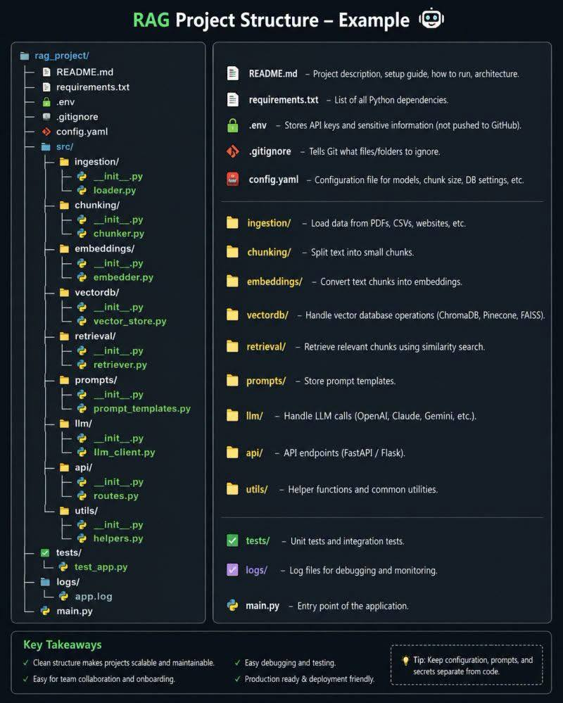
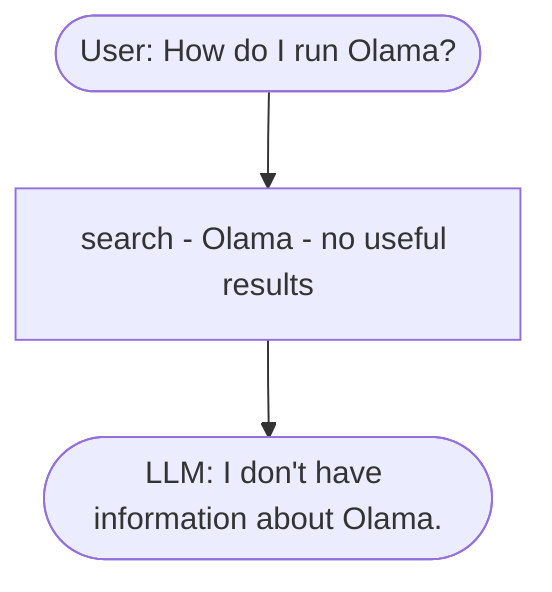
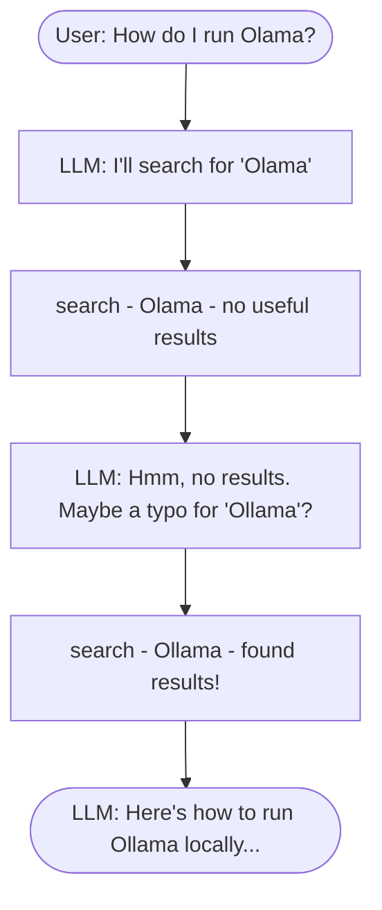

# hf-llm

## RAG architecture


## RAG project folder structure



## quickstart with Qdrant Locally

```bash
docker run -p 6333:6333 -p 6334:6334 -v "$(pwd)/qdrant_storage:/qdrant/storage:z" qdrant/qdrant
```

## Cai project thành một package (editable install)

```bash
uv pip install -e .
```

## Function Calling

The flow that broke:



### The agent alternative


