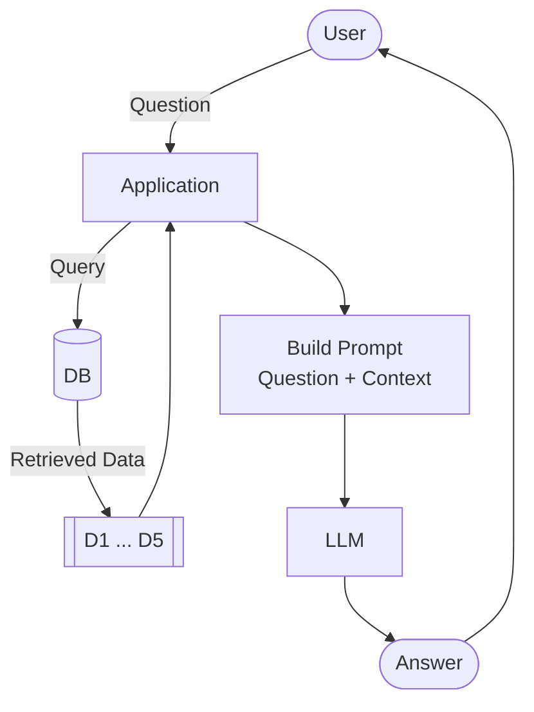

# hf-llm

## RAG architecture



## RAG project folder structure


## quickstart with Qdrant Locally

```bash
docker run -p 6333:6333 -p 6334:6334 -v "$(pwd)/qdrant_storage:/qdrant/storage:z" qdrant/qdrant
```
